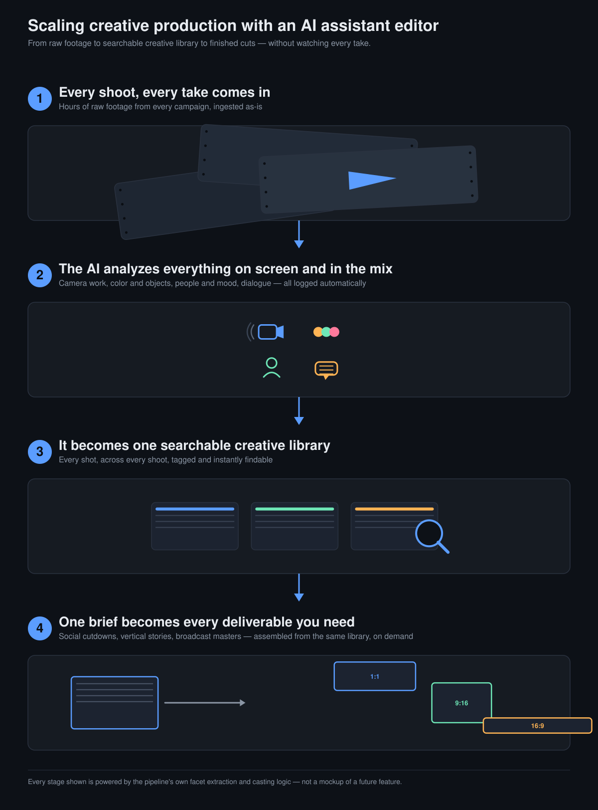

# Agentic Video Editor

A CLI tool that turns raw footage into an autonomous rough cut from a plain-language directive: detect cut points, transcribe locally, index everything into a searchable project, then resolve a directive into an edit plan, timeline, and rendered video.



Built for teams that shoot far more footage than they can ever manually review — an ad agency's raw campaign footage, for example. The system logs what's actually in every shot (camera movement, color and objects, people and mood, spoken dialogue) into one searchable library, so a plain-language brief can be turned into every cut a campaign needs — social cutdowns, vertical stories, broadcast masters — without anyone re-watching the source footage by hand.

## How the pipeline works

1. **Ingest** — media is added to a SQLite-backed project (`ave init`, `ave ingest`).
2. **Cut-point detection** — `ave cutpoints` runs ffmpeg's scene-change detector for shot changes and an audio-gap pass to find silence, producing frame-accurate snap targets for edits.
3. **Local transcription** — `ave align` runs word-level ASR with [faster-whisper](https://github.com/SYSTRAN/faster-whisper) entirely on-device, giving verbatim, timestamped word spans.
4. **Semantic indexing** — `ave analyze` / `ave semantic-analyze` / `ave facets` describe each shot (camera work, color, mood, dialogue) via a pluggable provider (Gemini, or a deterministic `mock` provider for offline/no-API-key runs). `ave export-cards` writes per-segment markdown cards, and `ave relate` mines cross-clip relationships via [qmd](https://github.com/tobi/qmd)'s vector search — the embedding-based retrieval layer across the project.
5. **Directive resolution** — `ave context-search` / `ave edit-plan` / `ave timeline` take a plain-language directive (e.g. "make a short documentary montage with a strong payoff") and resolve it against the indexed project into an edit plan and timeline, snapped to the detected cut points.
6. **Render** — `ave render` cuts the final MP4 with ffmpeg, with optional crossfades (`--crossfade-sec`) and burned-in captions (`--burn-captions`).

## Install

Requires Python 3.11 or 3.12 (per `pyproject.toml`), and [ffmpeg](https://ffmpeg.org/) on your `PATH`.

```bash
git clone https://github.com/dariiboi/agentic-video-editor.git
cd agentic-video-editor
pip install -e .
```

The base install has no third-party Python dependencies. Individual pipeline stages import their own optional packages and fail with a clear error if missing:

- `pip install faster-whisper` — required for `ave align` (local ASR)
- `pip install google-genai` — required for any command run with `--provider gemini` (the default for most analysis/planning commands); needs a `GEMINI_API_KEY` in a `.gemini_api.env` file at the project root (gitignored). Pass `--provider mock` to run those stages offline without a key.
- [qmd](https://github.com/tobi/qmd) CLI on your `PATH` — required for `ave relate` (embedding-based relationship mining) and for indexing the cards `ave export-cards` writes

## Usage

The first slice provides the durable project spine:

```bash
ave init ./project
ave ingest ./project /path/to/footage
ave assets ./project --json
```

Context-aware rough-cut workflow:

```bash
ave analyze ./project --json
ave cutpoints ./project --json                       # shot changes + audio gaps -> snap targets
ave align ./project --json                           # local word-level ASR (faster-whisper)
ave transcribe ./project --provider mock --json
ave semantic-analyze ./project --provider mock --json
ave context-build ./project --provider mock --json
ave export-cards ./project --json                    # markdown cards for qmd indexing
ave relate ./project --collection ave-project --json # embedding-mined relationships
ave context-search ./project "archive to live studio emotional payoff" --json
ave edit-plan ./project --directive "make a short documentary montage with a strong payoff" --duration-sec 45 --json
ave timeline ./project --directive "make a short documentary montage with a strong payoff" --duration-sec 45 --context-aware --json
ave render ./project --timeline-id latest --json     # add --crossfade-sec / --burn-captions
```

**Quick start for a new session:** run or read [`scripts/demo.sh`](scripts/demo.sh) —
it exercises the whole pipeline on `demo_projects/smoke_e_digglera`, maps each
module to the tables it writes, and ends with sqlite inspection one-liners.

See [docs/design/v1-agentic-video-editor.md](docs/design/v1-agentic-video-editor.md) for the V1 design.
See [docs/design/phase-execution-status.md](docs/design/phase-execution-status.md) for the current phase status against the dummy footage.
See [docs/design/generalized-directive-engine-handoff.md](docs/design/generalized-directive-engine-handoff.md) for the next build phase: arbitrary-directive handling with multi-facet ingest, ad-hoc narrative structures from compositional primitives, operation frames (compose/enumerate/subtract/transform), and decision provenance across the specificity spectrum.
See [docs/design/next-steps.md](docs/design/next-steps.md) for documentary-footage readiness and open gaps.
